# Sylvan Software Design Specification

Software Design Specification (SDS)

Project Name: Sylvan - Autonomous Driving Evaluation Technology Combining Virtual and Real Environments

Team Members: Jiye Liu, 2252752; Yuxuan Ou, 2252584

Document Version: 1.0

Submission Date: June 14, 2026

---

## Revision History

| Date       | Version | Description                                                                                                                                           | Author              |
| ---------- | ------- | ----------------------------------------------------------------------------------------------------------------------------------------------------- | ------------------- |
| 2026-06-10 | 0.1     | Created the initial document structure and defined the main sections according to the project documentation requirements.                             | Jiye Liu, Yuxuan Ou |
| 2026-06-11 | 0.2     | Added preliminary system background, project scope, and overall software architecture based on the SRS and project materials.                         | Jiye Liu            |
| 2026-06-12 | 0.3     | Supplemented module descriptions, including simulation control, CARLA integration, sensor configuration, traffic generation, and accident management. | Jiye Liu, Yuxuan Ou |
| 2026-06-13 | 0.4     | Revised the functional design and refined diagrams for the use case model, package structure, initialization process, and runtime workflow.           | Yuxuan Ou           |
| 2026-06-14 | 0.5     | Reviewed the local code repository and aligned the document content with the actual implementation structure and class responsibilities.              | Jiye Liu            |
| 2026-06-14 | 0.9     | Improved wording, formatting, version consistency, and technical descriptions; checked the correspondence between diagrams and text.                  | Jiye Liu, Yuxuan Ou |
| 2026-06-14 | 1.0     | Completed the formal draft based on the SRS, project materials, local code repository, and revision comments.                                         | Jiye Liu, Yuxuan Ou |


---

## Table of Contents

1. Introduction
2. System Overview
3. Architectural Design
4. Detailed Design
5. Data Design
6. Interface Design
7. Runtime Design
8. Error Handling and Fault Tolerance
9. Performance and Safety Design
10. Maintainability and Extensibility
11. Requirements-to-Design Traceability
12. Appendices

---

# 1. Introduction

## 1.1 Purpose

This document describes the software design of the Sylvan virtual-real integrated testing system for end-to-end autonomous driving. The SRS defines what the system shall do, while this SDS explains how the system is organized, how responsibilities are allocated, how data flows are handled, how external interfaces are managed, how the runtime loop works, and how real-time, safety, and maintainability goals are addressed.

The intended readers include:

- Sylvan developers;
- system testing and integration personnel;
- autonomous driving experiment operators;
- course project reviewers;
- researchers who will maintain, extend, or reproduce the experiments.

## 1.2 Document Conventions

This document follows the structure of an IEEE-style software design specification while adapting it to the actual code structure of this course project. Module names, class names, and file paths are kept consistent with the local repository as much as possible.

Design item IDs use the format `D-module-number`. For example:

- `D-APP-01` represents an application-layer design item;
- `D-DATA-01` represents a data source design item;
- `D-CAM-01` represents a camera design item.

## 1.3 Project Scope

Sylvan is a non-intrusive autonomous driving virtual-real integrated testing platform. The system uses CARLA as the simulation core, receives vehicle state data through ROS2 or JSON replay, synchronizes real or replayed vehicle pose and velocity to the CARLA ego vehicle, and renders forward traffic scenes through monocular or stereo virtual cameras for AEB/FCW validation of end-to-end autonomous driving functions.

This SDS covers the following software design scope:

1. Simulation startup, assembly, and main loop design;
2. CARLA client, synchronous mode, and actor lifecycle management;
3. Map loading, OpenDRIVE support, weather, and environment layer control;
4. ROS2 and JSON vehicle data sources;
5. Vehicle state application and yaw calibration;
6. Monocular/stereo cameras and image rendering pipeline;
7. Traffic objects, accident scenarios, and incident statistics;
8. Pygame UI, HUD, keyboard input, and resource cleanup;
9. Performance, safety, fault tolerance, maintainability, and extensibility design.

## 1.4 Design Goals

The system design goals are as follows:

| Goal | Description |
|---|---|
| Non-intrusive | Do not modify the test vehicle's CAN bus, controller, or original autonomous driving software |
| Real-time synchronization | Support a low-latency loop through CARLA synchronous mode, fixed FPS, and lightweight data processing |
| Reproducible experiments | Support JSON offline replay and controllable scene configuration |
| Modularity | Separate application, core, world, data source, sensor, traffic, accident, and UI domains |
| Extensibility | Keep extension points for data sources, cameras, maps, accident scenarios, and environment control |
| Cleanup capability | Release CARLA actors, sensors, ROS nodes, and Pygame resources uniformly |

## 1.5 Terms and Abbreviations

| Term | Meaning |
|---|---|
| SDS | Software Design Specification |
| SRS | Software Requirements Specification |
| CARLA | Autonomous driving simulation platform |
| ROS2 | Robot Operating System 2 |
| OpenDRIVE | Road network description standard |
| Ego Vehicle | The CARLA vehicle synchronized with real or replayed vehicle state |
| Actor | A CARLA simulation entity such as a vehicle, sensor, pedestrian, or obstacle |
| HUD | Status overlay in the simulation window |
| AEB | Automatic Emergency Braking |
| FCW | Forward Collision Warning |

---

# 2. System Overview

## 2.1 System Background

End-to-end autonomous driving systems are black-box in nature, and real roads or physical proving grounds cannot cover extreme long-tail scenarios at low cost and low risk. Sylvan builds controllable virtual scenes in CARLA and drives the virtual ego vehicle with real or replayed vehicle states, forming a virtual-real integrated testing loop. Its key value lies in external synchronization, external rendering, and external visual injection without intruding into the vehicle's internal control chain.

## 2.2 System Positioning

Sylvan is a locally running software prototype. It is neither a cloud platform nor vehicle control software. It targets closed-site experiments and offline debugging, and mainly performs the following responsibilities:

1. Connect to the CARLA server;
2. Assemble the simulation world, ego vehicle, cameras, traffic objects, and accident manager;
3. Receive ROS2 or JSON vehicle state data;
4. Apply vehicle state to the virtual ego vehicle;
5. Render visual scenes and display them;
6. Provide keyboard control, HUD status, and resource cleanup.

The system context design is shown below:


## 2.3 Design Scope

This document covers the main software packages under `src/carla_auto_vr`:

| Package | Design Responsibility |
|---|---|
| `app` | CLI entry point, Simulation assembly, main loop |
| `core` | CARLA client, synchronous mode, actor registry |
| `world` | Map loading, OpenDRIVE, weather, environment layers |
| `data_sources` | ROS2 bridge, JSON replay, state application, yaw calibration |
| `sensors` | Monocular/stereo cameras and image conversion |
| `traffic` | Dynamic traffic, static vehicles, traffic cones |
| `accidents` | Accident scenario management and statistics |
| `ui` | Display window, HUD, input handling, key mappings |
| `vehicle` | Ego vehicle spawning and keyboard control |
| `bootstrap` | CARLA and ROS environment preparation |
| `config` | Constants, settings, logging |

## 2.4 External Environment

The system depends on the CARLA server, ROS2 runtime, vehicle state source, display device, and test vehicle. The external environment interaction is shown below:

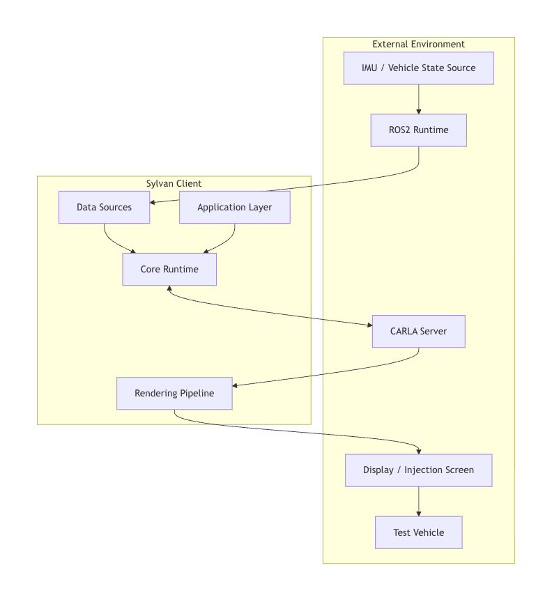

## 2.5 Main Design Constraints

| Constraint | Design Impact |
|---|---|
| CARLA must run synchronously | Introduce `CarlaClient.apply_sync_settings` and `CarlaSyncMode` |
| ROS messages must not block the main loop | `ROSBridge` uses a separate thread and lock |
| JSON should support reproducible experiments | `JsonFilePlayer` outputs data frame by frame |
| The real vehicle must remain non-intrusive | The system only outputs visual signals and does not control vehicle actuators |
| Map capabilities differ significantly | Built-in maps and OpenDRIVE maps use different traffic generation strategies |
| Accident scenarios may be limited by navmesh | The accident module uses probing and conservative disabling |
| Actors may remain in CARLA if not cleaned | Use `ActorRegistry` for unified lifecycle management |

---

# 3. Architectural Design

## 3.1 Overall Architecture

Sylvan uses a modular single-process architecture. The main process handles CARLA synchronous tick, image rendering, data application, HUD drawing, and input handling. ROS2 message processing runs in a separate thread to prevent communication blocking from affecting the simulation main loop.

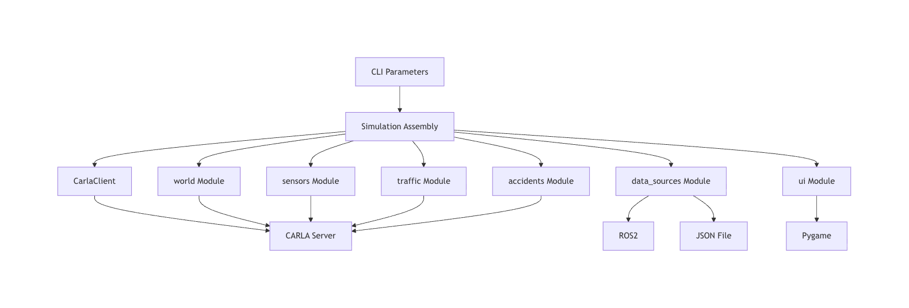

Overall design items:

| ID | Design Item |
|---|---|
| D-ARCH-01 | Use `Simulation` as the top-level assembly object holding major runtime components |
| D-ARCH-02 | Separate CARLA connection, synchronous mode, and actor lifecycle from business logic |
| D-ARCH-03 | Abstract ROS2 and JSON as unified vehicle data sources |
| D-ARCH-04 | Encapsulate image rendering in camera rigs so the main loop only calls a unified `process` interface |
| D-ARCH-05 | Keep environment control, traffic generation, and accident scenarios in separate functional domains |

## 3.2 Layered Architecture

The system is divided into the application control layer, core algorithm layer, hardware adaptation layer, and external environment layer.

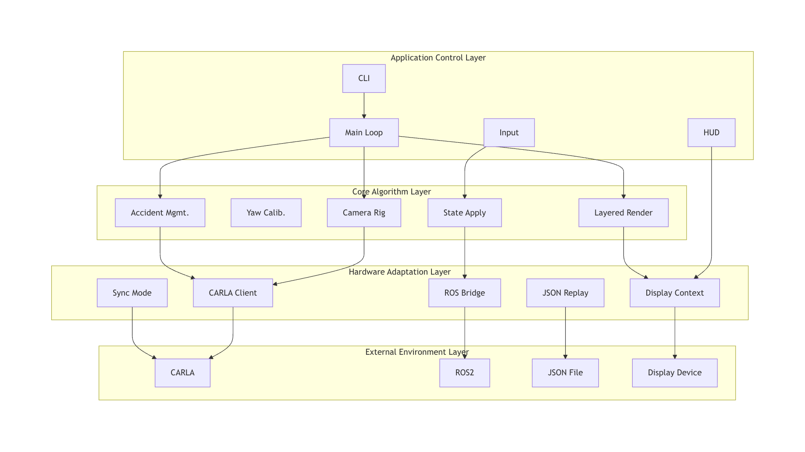

This layered design prevents the upper-level main loop from directly handling low-level connection details, while the lower-level adapters do not contain experiment workflow policies.

## 3.3 Package Structure Design

The code package structure is organized by functional domains to avoid assigning too many responsibilities to a single file:

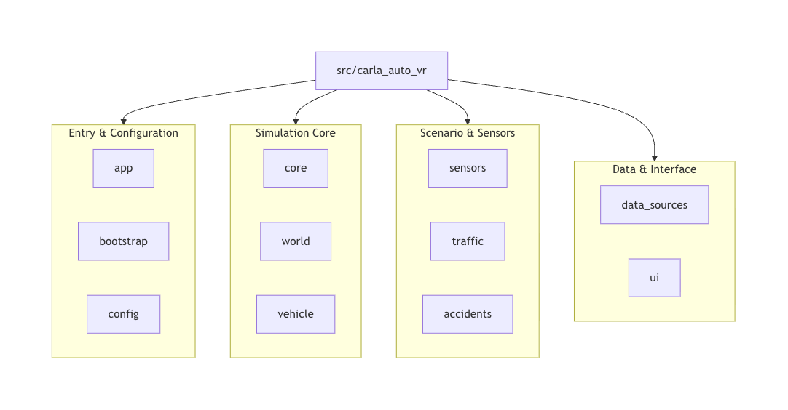

## 3.4 Module Dependency Relationship

Module dependencies follow the principle that the application layer depends downward, while lower layers do not depend back on the application layer. `Simulation` is one of the few objects aware of all modules. Other modules should depend only on CARLA, configuration, and logging where possible.

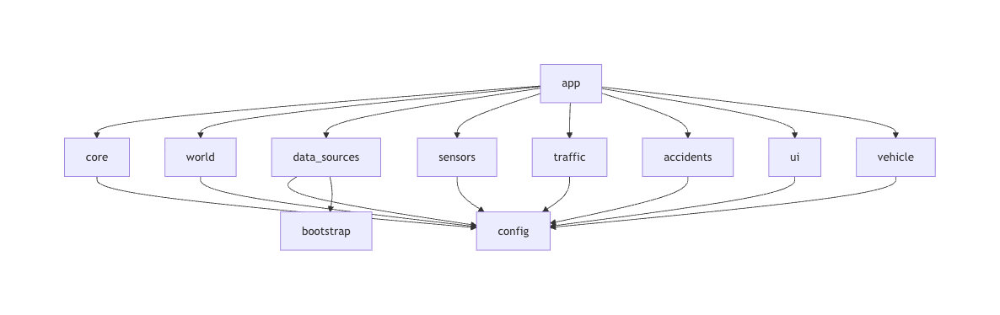

## 3.5 Key Design Decisions

| Decision | Description | Benefit |
|---|---|---|
| Use `Simulation` for top-level assembly | CLI only parses parameters; Simulation creates and connects components | Clear startup flow and easier extension |
| Use CARLA synchronous mode | Align world tick and camera frames through `CarlaSyncMode` | Reduces risk of image frame and physics frame mismatch |
| Use a unified data source protocol | ROS and JSON both expose `is_ready`, `poll`, and `shutdown`-style interfaces | Easier to add new data sources |
| Encapsulate yaw calibration | `YawCalibrator` handles coordinate conversion and offset tracking | Reduces complexity in the state application module |
| Use actor registry for cleanup | All created actors are registered in `ActorRegistry` | Avoids CARLA resource leakage |
| Enable accident simulation conservatively | Decide by map type and navmesh probing | Reduces segmentation fault and experiment interruption risk |
| Determine camera mode at startup | Monocular/stereo rigs are created at startup | Simplifies sensor lifecycle and synchronization queue management |

---

# 4. Detailed Design

## 4.1 Application Assembly and Main Loop Design (`app`)

The `app` package consists of `cli.py`, `simulation.py`, and `run_loop.py`.

| File | Main Responsibility |
|---|---|
| `cli.py` | Define command-line parameters, create `SimulationSettings`, and start the system |
| `simulation.py` | Connect and assemble CARLA, world, vehicle, sensors, traffic, data source, and accidents |
| `run_loop.py` | Drive the synchronous main loop, handle input, tick, rendering, data application, accident update, and HUD |

Design items:

| ID | Design Item |
|---|---|
| D-APP-01 | CLI is responsible for argument parsing and does not contain concrete simulation logic |
| D-APP-02 | `Simulation` acts as the runtime component container |
| D-APP-03 | The main loop uses `CarlaSyncMode` to obtain world snapshot and camera frames |
| D-APP-04 | Each frame follows the fixed order: input, tick, render, state application, accident update, HUD, flip |

The main loop design is shown below:

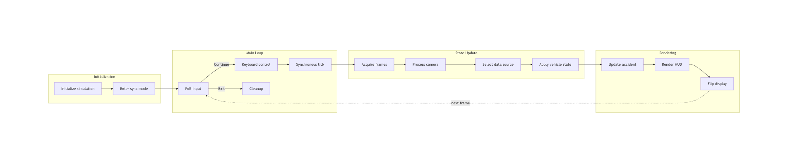

## 4.2 CARLA Client and Synchronous Mode Design (`core`)

The `core` package handles CARLA connection, synchronous mode, and actor lifecycle.

| Class | Responsibility |
|---|---|
| `CarlaClient` | Create CARLA client, obtain world, apply synchronous settings, configure TrafficManager |
| `CarlaSyncMode` | Align world tick and sensor listen queues, returning data from the same frame |
| `ActorRegistry` | Register, query by tag, destroy by tag, and destroy all actors |

### 4.2.1 `CarlaClient`

`CarlaClient` encapsulates CARLA connection details. This design avoids scattering `carla.Client` initialization, timeout settings, world acquisition, and synchronous settings across `Simulation` and other modules.

Key methods:

| Method | Description |
|---|---|
| `connect()` | Create client, set timeout, read server version and current world |
| `apply_sync_settings(fps)` | Enable synchronous mode, fixed delta, and physics substepping |
| `ensure_sync_and_traffic_manager(fps)` | Re-confirm world and TrafficManager synchronous mode during runtime |
| `precheck(host, port)` | Optional connection precheck |

### 4.2.2 `CarlaSyncMode`

`CarlaSyncMode` is a context manager. On enter, it registers queues for world tick and each sensor. On each `tick`, it advances the CARLA world and retrieves data matching the current frame from the queues.

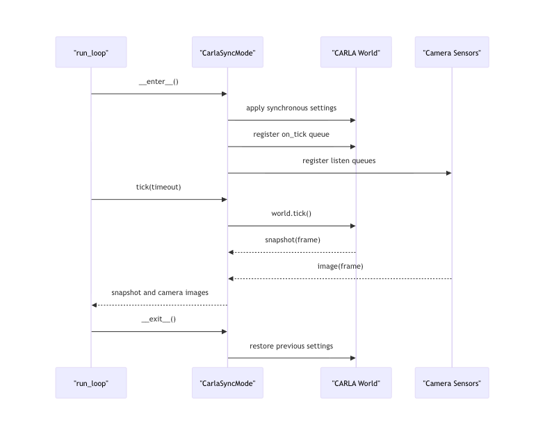

### 4.2.3 `ActorRegistry`

`ActorRegistry` manages actors with a list and a tag dictionary. The ego vehicle, cameras, and traffic objects should be registered after creation. On system exit, `destroy_all()` checks each actor's `is_alive` state and destroys it.

## 4.3 World, Map, and Environment Control Design (`world`)

The `world` package handles map loading, OpenDRIVE support, weather control, and environment layer control.

| Module | Responsibility |
|---|---|
| `map_loader.py` | Switch CARLA built-in Town maps |
| `opendrive_loader.py` | Resolve `.xodr` path and generate OpenDRIVE world |
| `weather.py` | Scan and cycle CARLA weather presets |
| `layered_renderer.py` | Hide, restore, and query environment objects |

The map loading strategy is shown below:

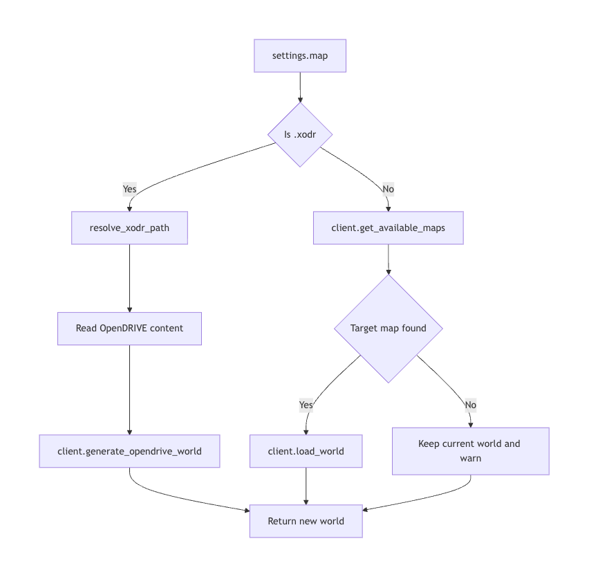

Environment layer design uses CARLA `CityObjectLabel` to obtain IDs of buildings, vegetation, fences, poles, walls, and other objects, and uses `world.enable_environment_objects` to hide or restore them. This is suitable for removing visual distractions in injection scenes.

## 4.4 Vehicle Data Source Design (`data_sources`)

Vehicle data sources use the unified `VehicleDataSource` protocol. This protocol defines `is_ready()`, `poll()`, and optional `shutdown()`, allowing ROS2 real-time data and JSON offline replay to be consumed in the same way by the main loop.

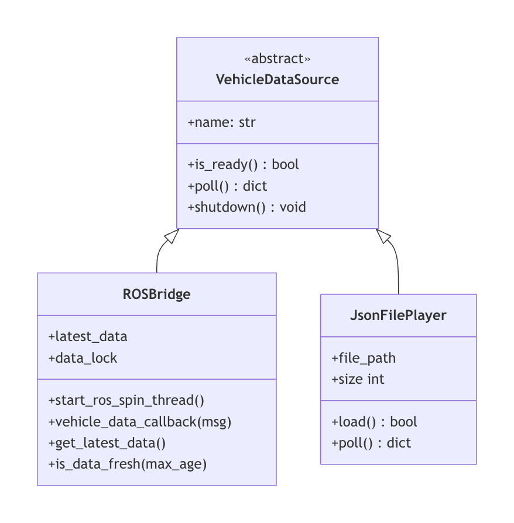

### 4.4.1 ROSBridge Design

`ROSBridge` inherits from both ROS2 `Node` and `VehicleDataSource`. It subscribes to multiple vehicle data topics, parses custom or standard array messages, and writes the result into `latest_data`.

Key design points:

1. Use a separate thread to run `rclpy.spin_once`;
2. Use `threading.Lock` to protect `latest_data`;
3. Prefer `Gongjicarla`, and fall back to `Float32MultiArray`;
4. Periodically check available topics and signal status;
5. Provide `is_data_fresh` for HUD status display.

### 4.4.2 JsonFilePlayer Design

`JsonFilePlayer` supports offline debugging and reproducible experiments. During loading, the JSON root must be an array. During runtime, each `poll` returns the next data frame. This design allows offline data to reuse the same state application flow as ROS data.

## 4.5 Vehicle State Application and Yaw Calibration Design

`VehicleStateApplier` applies unified vehicle state data to the CARLA ego vehicle. `YawCalibrator` handles direction conversion and initial offset calibration from ROS yaw to CARLA yaw.

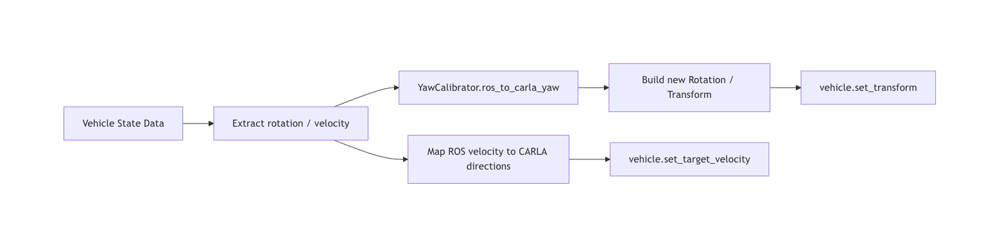

Design points:

| Design Item | Description |
|---|---|
| Yaw direction conversion | Convert ROS yaw from radians to degrees, then negate according to CARLA coordinates |
| Initial offset | On first received data, calculate offset from current CARLA yaw and converted ROS yaw |
| Velocity mapping | ROS `x` means forward and `y` means left; CARLA uses forward/right, so y is negated |
| Exception isolation | A malformed frame logs a warning but does not interrupt the main loop |

## 4.6 Camera and Image Pipeline Design (`sensors`)

The camera module is abstracted as `SensorRig`. Current implementations include `MonoCameraRig` and `StereoCameraRig`.

| Class | Design Responsibility |
|---|---|
| `SensorRig` | Base sensor rig, defining `attach`, `process`, and `destroy` interfaces |
| `MonoCameraRig` | Create one full-width RGB camera for lightweight forward display |
| `StereoCameraRig` | Create two RGB cameras to simulate stereo forward layout |
| `image_pipeline` | Convert CARLA images into Pygame surfaces |

The camera mode design is shown below:

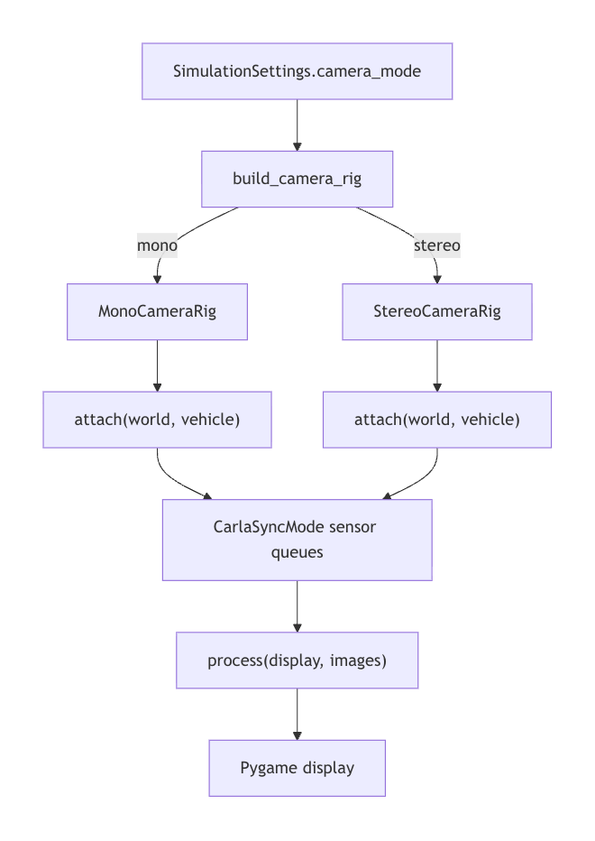


Design decision: camera mode is determined at startup and does not support runtime hot switching. This is because CARLA sensor listen queues are registered by `CarlaSyncMode` when entering the context, and switching at runtime would require queue reconstruction, actor destruction, and additional frame synchronization complexity.

## 4.7 Traffic Object Design (`traffic`)

The traffic module uses different strategies by map type:

1. CARLA built-in maps: generate dynamic traffic;
2. OpenDRIVE maps: generate static vehicles and traffic cones to avoid depending on dynamic traffic manager topology support.

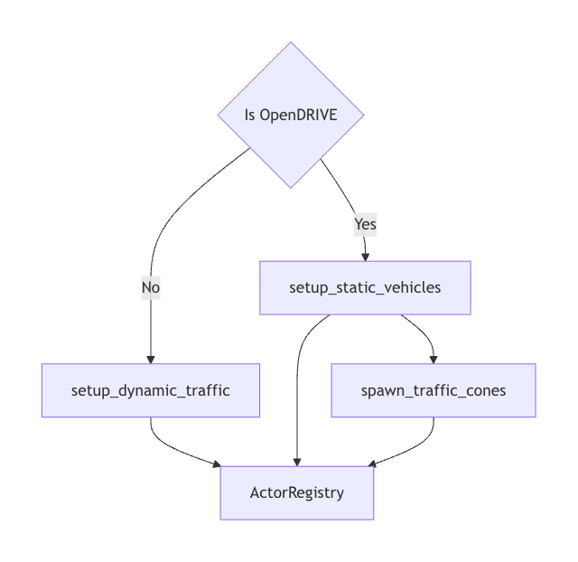


This design separates traffic generation from the main loop, allowing future extensions such as traffic density control, fixed obstacle layouts, or special vehicle behaviors.

## 4.8 Accident Scenario Management Design (`accidents`)

The accident module consists of `AccidentManager` and `IncidentStats`. The current `AccidentManager` is an adapter layer: it exposes a stable interface externally while remaining compatible with the existing `accident_simulation.AccidentSimulation` implementation internally.

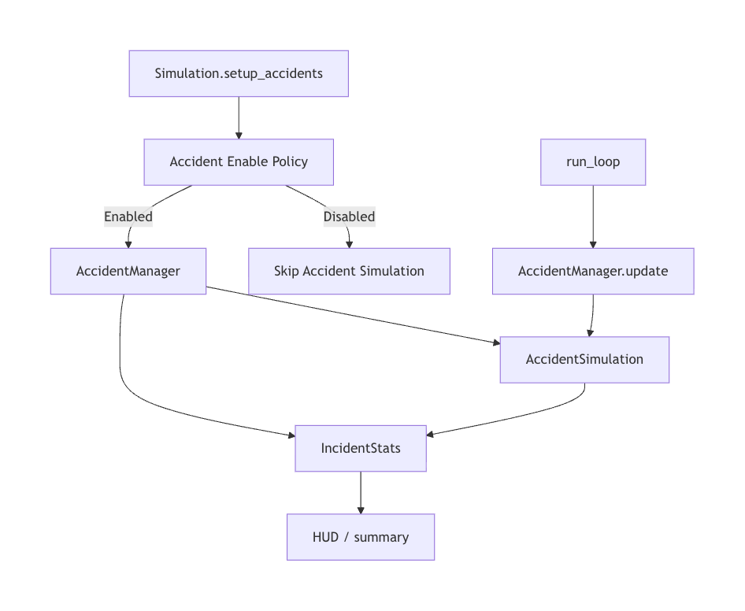

Enable policy:

1. Disable directly when explicitly turned off;
2. Disable by default for OpenDRIVE maps and maps known to lack pedestrian navmesh;
3. Probe regular maps through `get_random_location_from_navigation`;
4. Allow force-enable through `--accidents`, but log a risk warning.

## 4.9 UI, HUD, and Input Design (`ui`)

The UI module includes display context, input event handling, key mappings, and HUD rendering.

| Class/Module | Responsibility |
|---|---|
| `DisplayContext` | Initialize Pygame, create window, clock, and font |
| `InputHandler` | Read Pygame events and invoke callbacks |
| `InputCallbacks` | Define callback collection from input events to business actions |
| `keybindings.py` | Centralize keyboard shortcuts |
| `hud.py` | Render speed, yaw, weather, camera, ROS, and accident status |

Input handling uses a callback design so that `InputHandler` does not directly depend on `Simulation`, reducing coupling between the UI layer and business objects.

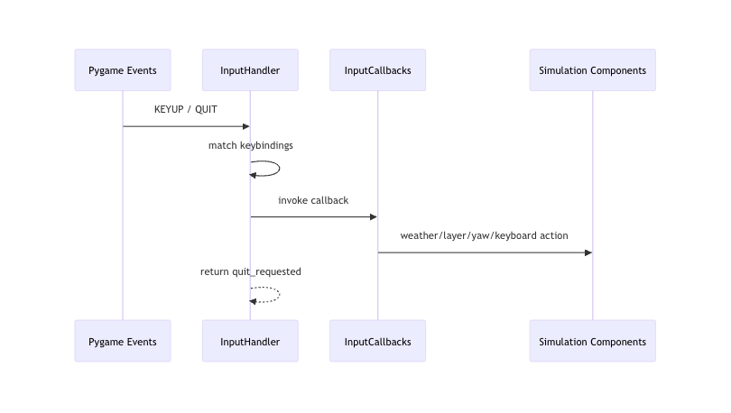


## 4.10 Resource Cleanup and Lifecycle Design

Resource cleanup is triggered uniformly by `Simulation.cleanup()`, ensuring that resources are released as much as possible during normal exit, keyboard interruption, or abnormal exit.


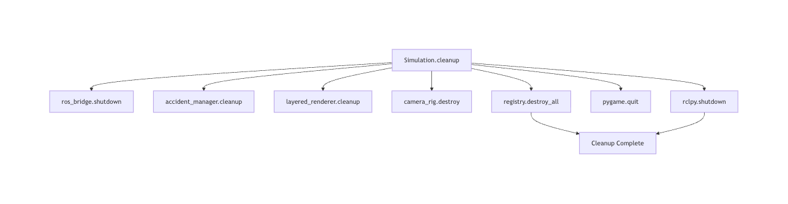


The cleanup order first stops external communication and high-level scenarios, then destroys sensors and actors, and finally releases UI and ROS runtime resources.

---

# 5. Data Design

## 5.1 Vehicle State Data

Vehicle state data is the unified data format shared by ROSBridge, JsonFilePlayer, and VehicleStateApplier.

```json
{
  "timestamp": 1710000000,
  "rotation": {
    "roll": 0.0,
    "pitch": 0.0,
    "yaw": 0.0
  },
  "velocity": {
    "x": 0.0,
    "y": 0.0,
    "z": 0.0
  }
}
```

| Field | Design Description |
|---|---|
| `timestamp` | Records the vehicle state frame time; optional |
| `rotation.yaw` | Input ROS yaw in radians, converted by the calibrator |
| `velocity.x` | Forward velocity |
| `velocity.y` | Lateral velocity; negated when converting ROS leftward to CARLA rightward |
| `velocity.z` | Vertical velocity, usually 0 |

## 5.2 Simulation Configuration Data

`SimulationSettings` is the structured internal representation of CLI parameters. This design avoids passing `argparse.Namespace` directly among modules.

| Field | Design Usage |
|---|---|
| `host`, `port` | CARLA service connection |
| `json`, `ros` | Data source selection |
| `map` | Map loading |
| `clean_environment`, `no_buildings`, `no_vegetation`, `no_fences` | Initial environment layer control |
| `layered_rendering` | Whether to enable layered rendering |
| `mono_camera`, `stereo_camera` | Camera mode selection |
| `accidents` | Accident simulation enable policy |

## 5.3 Camera Frame Data

Camera frames are produced by CARLA sensor listen queues. `CarlaSyncMode` ensures that the world snapshot and camera images read in each main loop iteration have the same frame number.

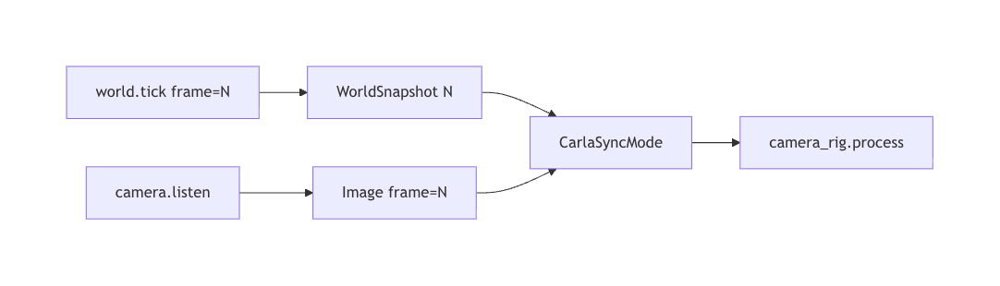


## 5.4 Environment Layer State Data

`LayeredRenderer` uses a dictionary to store environment layer switches:

| Layer | Meaning |
|---|---|
| `ROADS` | Roads |
| `VEHICLES` | Vehicles |
| `PEDESTRIANS` | Pedestrians |
| `BUILDINGS` | Buildings |
| `VEGETATION` | Vegetation |
| `FENCES` | Fences |
| `POLES` | Poles |
| `WALLS` | Walls |
| `TERRAIN` | Terrain |
| `SKY` | Sky |
| `TRAFFIC_SIGNS` | Traffic signs |

## 5.5 Incident Statistics Data

`IncidentStats` stores accident results in a counter dictionary. Fields include `successful_crossing`, `potential_collision`, `timeout`, `vehicle_braking`, and `vehicle_lane_change`. This structure makes it easy to add new incident result types later.

## 5.6 Log Data

The logging system records startup, connection, map loading, ROS subscription, data parsing, weather switching, environment layer operations, accident status, and resource cleanup. The design goal is to help experiment operators quickly locate configuration errors, external dependency failures, and runtime exceptions.

The core data flow is shown below:

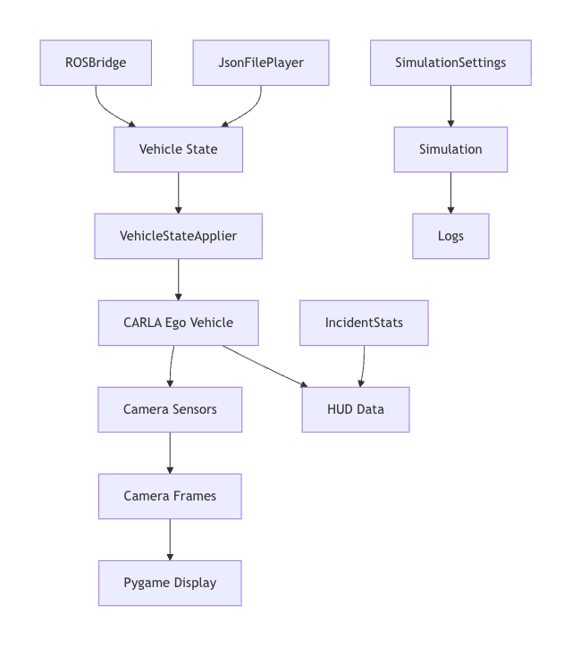


---

# 6. Interface Design

## 6.1 Command-line Interface

The command-line interface is defined by `argparse.ArgumentParser` in `cli.py`. Its design responsibility is to provide runtime configuration and convert user input into `SimulationSettings`.

| Parameter | Design Description |
|---|---|
| `--host`, `--port` | Configure CARLA service address |
| `--json` | Specify offline replay data source |
| `--ros` | Enable ROS data source |
| `--debug` | Switch logging level |
| `--map` | Specify Town map or `.xodr` file |
| `--clean-environment` | Create a clean visual scene |
| `--mono-camera`, `--stereo-camera` | Select camera rig |
| `--accidents` | Control accident simulation enable policy |

## 6.2 ROS2 Communication Interface

The ROS2 interface is handled by `ROSBridge`. The design supports primary topics and fallback topics, as well as both custom and standard array message formats.

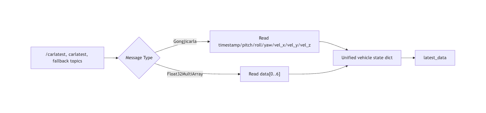


## 6.3 JSON File Interface

The JSON file interface requires the root node to be an array, where each array element is a vehicle state frame. JSON replay has higher priority than ROS: once `--json` is specified, the system does not enable the ROS data source.

## 6.4 CARLA API Interface

The CARLA API interface covers the following operations:

| Operation | Usage Location |
|---|---|
| Create client and get world | `CarlaClient` |
| Apply synchronous settings | `CarlaClient`, `CarlaSyncMode` |
| Load Town map | `map_loader` |
| Generate OpenDRIVE world | `opendrive_loader` |
| Spawn vehicles, cameras, traffic objects | `vehicle`, `sensors`, `traffic` |
| Set weather | `WeatherController` |
| Hide/restore environment objects | `LayeredRenderer` |

## 6.5 Pygame Display and Input Interface

The Pygame interface is encapsulated by `DisplayContext`, `InputHandler`, and HUD rendering functions. By design, Pygame only appears in the UI layer and camera image conversion layer, preventing it from spreading into data source and world management modules.

## 6.6 External Hardware and Experiment Interfaces

External hardware interfaces focus on data input and visual output:

1. Input: IMU or vehicle state source enters the system through ROS2;
2. Output: the Pygame window is observed by the vehicle forward camera through a display device or injection screen;
3. Feedback: the vehicle's AEB/FCW response is recorded by experiment operators or collected through future extension interfaces.

---

# 7. Runtime Design

## 7.1 Startup Flow


## 7.2 Synchronous Simulation Loop

The synchronous simulation loop is driven by `run_loop`. The main loop uses CARLA world tick as the clock, ensuring that sensor data and simulation state are aligned. Every 100 frames, the real FPS is calculated as an observation metric.

## 7.3 Data Source Selection Strategy

The data source selection strategy is shown below:

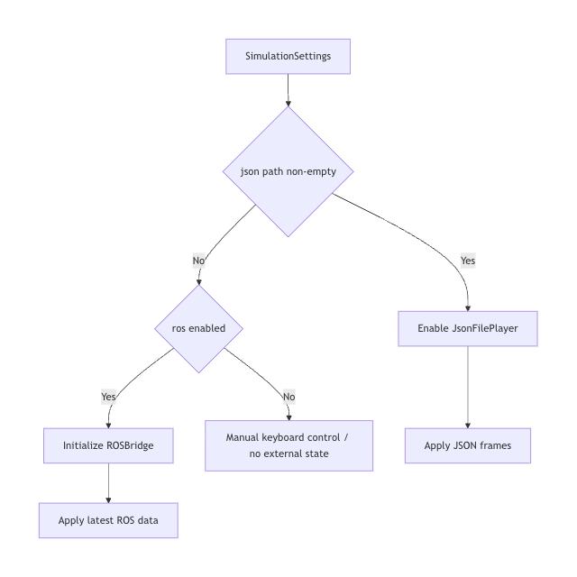

## 7.4 Map Loading Strategy

Map loading is invoked by `Simulation.connect()`. If `--map` ends with `.xodr`, the OpenDRIVE generation flow is used; otherwise the built-in Town map switching flow is used.

## 7.5 Camera Mode Selection Strategy

Camera mode is determined by `SimulationSettings.camera_mode`. The current default priority is: if `mono_camera` is specified, use monocular; otherwise use stereo. The camera rig is built in `Simulation.__init__` and attached in `setup_sensors`.

## 7.6 Accident Simulation Enable Strategy

The accident simulation enable strategy prioritizes safety:

1. Explicit disable has highest priority;
2. OpenDRIVE maps are disabled by default;
3. Maps without pedestrian navmesh are disabled by default;
4. Regular maps must pass runtime navmesh probing;
5. Explicit force-enable outputs a warning.

## 7.7 Exit and Cleanup Flow

Exit triggers include window close, `Esc` key, keyboard interruption, and main loop exception. After exit, the unified cleanup flow is executed. Cleanup failures should not prevent other cleanup actions, so each cleanup step catches exceptions separately and logs them.

---

# 8. Error Handling and Fault Tolerance

| Error Scenario | Handling Strategy |
|---|---|
| CARLA client creation fails | Log error and raise exception; startup fails |
| Unable to get CARLA server version | Log that the server may not be running; startup fails |
| Built-in map does not exist | Output warning and keep current world |
| OpenDRIVE file does not exist | Raise `FileNotFoundError`; startup fails |
| ROS environment initialization fails | Log error, set ROSBridge to None, allow system to continue |
| Custom ROS message unavailable | Automatically fall back to `Float32MultiArray` |
| JSON file missing or malformed | Log error and do not enable JSON replay |
| Vehicle state frame malformed | Log warning and skip the current frame |
| Accident manager initialization fails | Log error and disable accident simulation |
| Synchronous queue timeout | Raise runtime exception; main loop logs error and exits |
| Actor destruction fails | Log warning and continue destroying other actors |

Fault tolerance principles:

1. Stop startup when the core chain fails to avoid invalid experiment results;
2. Degrade gracefully when optional functions fail;
3. A single malformed frame should not affect later frames;
4. Cleanup should release as many resources as possible.

---

# 9. Performance and Safety Design

## 9.1 60 FPS Synchronous Simulation Design

The default FPS is 60. `CarlaClient.apply_sync_settings` sets `fixed_delta_seconds = 1.0 / fps` and enables physics substepping. `CarlaSyncMode` uses the same FPS to calculate delta and aligns world snapshots with sensor data by frame number.

## 9.2 50 ms Closed-loop Latency Target Design

The system supports the 50 ms closed-loop latency target through the following designs:

1. Use CARLA synchronous mode to reduce frame uncertainty;
2. Run ROS message handling in a separate thread;
3. Apply only the latest ROS data in the main loop without blocking for new messages;
4. Read JSON replay in frame order for offline performance reproduction;
5. Keep image processing limited to necessary conversion from CARLA image to Pygame surface.

## 9.3 ROS Separate Thread Design

`ROSBridge._ros_spin` repeatedly runs `rclpy.spin_once` in a thread, while the main loop reads the latest state through `get_latest_data`. This design sacrifices strict per-message consumption but improves simulation loop stability and reduces blocking risk.

## 9.4 Image Rendering Performance Design

Monocular mode creates one camera and is suitable for low-load debugging. Stereo mode creates two half-width cameras and is suitable for simulating a stereo forward-view layout. The rendering pipeline avoids complex post-processing and only performs necessary image conversion and blitting.

## 9.5 Non-intrusive Safety Boundary

The system strictly follows the non-intrusive boundary:

1. Do not write to vehicle CAN;
2. Do not control vehicle actuators;
3. Do not modify vehicle autonomous driving software;
4. Do not reverse engineer low-level vehicle protocols;
5. Only affect the vehicle's forward perception input through external visual display/injection.

## 9.6 Real Vehicle Experiment Safety

Real vehicle experiments must be conducted on a closed site. At the software level, the system reduces misoperation risk through conservative accident enable policy, explicit log warnings, keyboard exit, resource cleanup, and HUD status display, but it cannot replace on-site safety management.

---

# 10. Maintainability and Extensibility Design

## 10.1 Modular Directory Structure

The system is split by functional domain to reduce coupling. New functionality should first be placed in the corresponding domain module rather than expanding the responsibilities of `run_loop` or `cli`.

## 10.2 Unified Data Source Protocol

`VehicleDataSource` provides a unified entry for data source extension. Future data sources such as UDP, CSV, database, or vehicle bus proxy can be added by implementing `is_ready` and `poll`.

## 10.3 Camera Mode Extension

`SensorRig` provides extension interfaces for new camera modes. Future modes may include fisheye, semantic segmentation, depth, or multi-camera layouts, but sensor queues and display layout must be considered together.

## 10.4 Accident Scenario Extension

`BaseScenario` defines the accident scenario protocol, and `AccidentManager` acts as a high-level manager. Legacy accident logic can be gradually split into independent scenario classes in the future.

## 10.5 Map and Environment Control Extension

OpenDRIVE search paths and generation parameters are located in the configuration layer, making it possible to add more map directories later. Environment layer control can be extended with additional CARLA-supported `CityObjectLabel` types.

## 10.6 Centralized Key Mapping

Key mappings are centralized in `ui/keybindings.py`, preventing shortcuts from being scattered across input handling and business logic. Future shortcuts should first update keybindings and then add corresponding callbacks in `InputCallbacks`.

## 10.7 Logging and Resource Management

Logging is provided through unified logging configuration. All created external resources should be registered or stored as references and released in `Simulation.cleanup`.

---

# 11. Requirements-to-Design Traceability

| SRS Requirement Group | SDS Design Sections | Main Implementation Modules |
|---|---|---|
| `F-SIM` CARLA simulation environment management | 4.1, 4.2, 7.1, 7.2 | `Simulation`, `CarlaClient`, `CarlaSyncMode` |
| `F-MAP` map and OpenDRIVE loading | 4.3, 7.4 | `map_loader`, `opendrive_loader` |
| `F-STATE` vehicle state synchronization | 4.5, 5.1, 7.3 | `VehicleStateApplier`, `YawCalibrator` |
| `F-ROS` ROS bridge | 4.4, 6.2, 9.3 | `ROSBridge` |
| `F-JSON` JSON replay | 4.4, 6.3, 7.3 | `JsonFilePlayer` |
| `F-CAM` camera rendering | 4.6, 5.3, 9.4 | `MonoCameraRig`, `StereoCameraRig`, `image_pipeline` |
| `F-ENV` weather and environment layers | 4.3, 10.5 | `WeatherController`, `LayeredRenderer` |
| `F-TRAFFIC` traffic objects | 4.7 | `traffic.dynamic`, `traffic.static_vehicles`, `traffic.cones` |
| `F-ACC` accident scenarios | 4.8, 7.6 | `AccidentManager`, `IncidentStats` |
| `F-HUD` HUD display | 4.9, 6.5 | `hud`, `DisplayContext` |
| `F-CTRL` command-line and keyboard control | 4.1, 4.9, 6.1 | `cli`, `InputHandler`, `keybindings` |
| Performance requirements `P-01` to `P-07` | 9.1 to 9.4 | `CarlaSyncMode`, `ROSBridge`, `sensors` |
| Safety and reliability requirements | 8, 9.5, 9.6 | `Simulation.cleanup`, `ActorRegistry`, accident policy |

---

# 12. Appendices

## 12.1 Module List

| Module | Example Files |
|---|---|
| Application layer | `app/cli.py`, `app/simulation.py`, `app/run_loop.py` |
| Core layer | `core/client.py`, `core/sync_mode.py`, `core/actor_registry.py` |
| World layer | `world/map_loader.py`, `world/opendrive_loader.py`, `world/weather.py`, `world/layered_renderer.py` |
| Data sources | `data_sources/ros_bridge.py`, `data_sources/json_player.py`, `data_sources/state_applier.py`, `data_sources/yaw_calibrator.py` |
| Sensors | `sensors/mono_camera.py`, `sensors/stereo_camera.py`, `sensors/image_pipeline.py` |
| Traffic | `traffic/dynamic.py`, `traffic/static_vehicles.py`, `traffic/cones.py` |
| Accidents | `accidents/manager.py`, `accidents/stats.py`, `accidents/scenarios/base.py` |
| UI | `ui/display.py`, `ui/input_handler.py`, `ui/keybindings.py`, `ui/hud.py` |

## 12.2 Key Class Responsibility Table

| Class | Responsibility Summary |
|---|---|
| `Simulation` | Top-level assembly and resource holder |
| `CarlaClient` | CARLA connection and synchronous settings |
| `CarlaSyncMode` | Synchronize world tick and sensor frames |
| `ActorRegistry` | Unified actor lifecycle management |
| `ROSBridge` | ROS2 message subscription and conversion |
| `JsonFilePlayer` | Offline JSON state frame replay |
| `VehicleStateApplier` | Apply vehicle state to CARLA ego vehicle |
| `YawCalibrator` | Yaw coordinate conversion and initial offset calibration |
| `MonoCameraRig` | Monocular forward camera |
| `StereoCameraRig` | Stereo forward cameras |
| `LayeredRenderer` | Environment object visibility control |
| `WeatherController` | Weather preset switching |
| `AccidentManager` | Accident scenario adaptation and management |
| `DisplayContext` | Pygame display context |
| `InputHandler` | Keyboard and window event dispatch |

## 12.3 Mermaid Diagram List

| Section | Diagram |
|---|---|
| 2.2 | System context diagram |
| 2.4 | External environment interaction diagram |
| 3.1 | Overall architecture diagram |
| 3.2 | Layered architecture diagram |
| 3.3 | Package structure diagram |
| 3.4 | Module dependency diagram |
| 4.1 | Main loop activity diagram |
| 4.2 | Synchronous mode sequence diagram |
| 4.3 | Map loading flowchart |
| 4.4 | Data source class diagram |
| 4.5 | State application flowchart |
| 4.6 | Camera mode flowchart |
| 4.7 | Traffic strategy flowchart |
| 4.8 | Accident management structure diagram |
| 4.9 | Input handling sequence diagram |
| 4.10 | Resource cleanup flowchart |
| 5.3 | Camera frame synchronization diagram |
| 5.6 | Core data flow diagram |
| 6.2 | ROS message interface diagram |
| 7.1 | Startup flowchart |
| 7.3 | Data source selection diagram |

## 12.4 Future Design Improvement Suggestions

1. Gradually split legacy accident simulation into multiple `BaseScenario` subclasses;
2. Add an automated performance statistics module to record end-to-end latency and frame rate;
3. Add experiment configuration files to reduce complex CLI parameter input;
4. Add persistence for rendering calibration parameters;
5. Add test cases and simulation replay result export;
6. Add clearer command-line switches such as `--no-ros`, `--no-layered-rendering`, and `--no-accidents`.
