# Sylvan Software Requirements Specification

Software Requirements Specification (SRS)

Project Name: Sylvan - Autonomous Driving Evaluation Technology Combining Virtual and Real Environments

Team Members: Jiye Liu, 2252752; Yuxuan Ou, 2252584

Document Version: 1.0

Submission Date: June 14, 2026

---

## Revision History

| Date       | Version | Description                                                                                                                                                  | Author              |
| ---------- | ------- | ------------------------------------------------------------------------------------------------------------------------------------------------------------ | ------------------- |
| 2026-06-12 | 0.1     | Created the initial document framework and organized the main sections according to the project charter, POS, and project presentation.                      | Jiye Liu, Yuxuan Ou |
| 2026-06-13 | 0.5     | Added detailed project background, objectives, scope, system overview, and preliminary design content based on the local code repository.                    | Jiye Liu, Yuxuan Ou |
| 2026-06-14 | 1.0     | Completed the formal draft after revising technical descriptions, checking consistency with the project materials, and refining the overall document format. | Jiye Liu, Yuxuan Ou |

---

## Table of Contents

1. Introduction
   - 1.1 Purpose
   - 1.2 Document Conventions
   - 1.3 Product Scope
   - 1.4 Definitions, Acronyms, and Abbreviations
   - 1.5 References
2. Overall Description
   - 2.1 Product Perspective
   - 2.2 Product Functions
   - 2.3 User Characteristics
   - 2.4 Constraints
   - 2.5 Assumptions and Dependencies
   - 2.6 Requirements Allocation
3. Specific Requirements
   - 3.1 External Interface Requirements
   - 3.2 Functional Requirements
   - 3.3 Performance Requirements
   - 3.4 Attributes / Non-functional Requirements
   - 3.5 Logical Data Requirements
4. Appendices

---

# 1. Introduction

## 1.1 Purpose

This Software Requirements Specification (SRS) describes the functional requirements, external interface requirements, performance requirements, and non-functional requirements of the Sylvan virtual-real integrated testing system for end-to-end autonomous driving. This document serves as the basis for system design, implementation, integration testing, vehicle-level experiments, and course project acceptance.

The intended readers include:

- project development team members;
- system integration and testing personnel;
- autonomous driving experiment operators;
- project managers;
- course reviewers;
- future maintenance and extension personnel.

## 1.2 Document Conventions

This SRS uses English as the main language while keeping project-specific terms consistent with the implementation. Requirement IDs use a module prefix plus a sequence number. For example, `F-SIM-01` represents the first functional requirement of the simulation environment management module.

Requirement priorities are defined as follows:

| Priority | Meaning |
|---|---|
| High | Must be implemented; directly affects the core experimental loop and acceptance |
| Medium | Should be implemented; improves experiment efficiency, maintainability, or extensibility |
| Low | May be implemented; mainly improves usability or supports future expansion |

## 1.3 Product Scope

Product name: Sylvan - Autonomous Driving Evaluation Technology Combining Virtual and Real Environments.

Sylvan is a non-intrusive virtual-real integrated testing platform for safety evaluation of end-to-end autonomous driving systems. The system uses CARLA as the core simulation environment, receives real vehicle or offline vehicle motion data through ROS2 or JSON replay, synchronizes vehicle pose and velocity to a virtual ego vehicle in CARLA, and renders forward-facing virtual traffic scenes for observing the response of real vehicle perception systems, FCW, AEB, and related functions in long-tail hazardous scenarios.

Product goals:

1. Build high-fidelity virtual road and traffic scenes based on CARLA;
2. Synchronize pose and velocity from real vehicles or replay data to the virtual ego vehicle;
3. Generate monocular or stereo virtual images for forward-view visual injection experiments;
4. Support controllable configuration of weather, maps, environment objects, traffic participants, and hazardous scenarios;
5. Evaluate the safety boundary of end-to-end autonomous driving systems in extreme long-tail scenarios without modifying the test vehicle's CAN bus, low-level controllers, or original autonomous driving software.

Main functions:

1. CARLA service connection, synchronous mode, and simulation world management;
2. CARLA built-in Town map loading and OpenDRIVE `.xodr` map loading;
3. ROS2 real-time vehicle data bridging;
4. JSON offline vehicle state replay;
5. ROS yaw to CARLA yaw offset calibration;
6. Monocular and stereo RGB camera rendering;
7. Weather preset switching and environment layer visibility control;
8. Dynamic traffic, static vehicles, traffic cones, and hazardous scenario management;
9. HUD status display, keyboard control, and command-line configuration;
10. Cleanup of simulation resources, ROS nodes, Pygame display, and CARLA actors.

Product benefits:

- Reduces the cost of reproducing long-tail hazardous scenarios on real roads and proving grounds;
- Reduces safety risks in real vehicle testing;
- Improves validation efficiency for FCW/AEB through repeatable virtual scenarios;
- Supports non-intrusive experiments around black-box autonomous driving systems;
- Provides a software foundation for future multi-scenario, multi-weather, and multi-map autonomous driving tests.

Application domains: autonomous driving safety validation, end-to-end model evaluation, virtual-real integrated testing, AEB/FCW experiments, and course engineering project prototype validation.

## 1.4 Definitions, Acronyms, and Abbreviations

| Term | Definition |
|---|---|
| SRS | Software Requirements Specification |
| Sylvan | The virtual-real integrated testing system developed in this project |
| CARLA | Open-source autonomous driving simulator for virtual roads, vehicles, sensors, and traffic scenes |
| ROS2 | Robot Operating System 2, used for vehicle state data bridging and message communication |
| JSON | JavaScript Object Notation, used for offline vehicle state replay in this project |
| OpenDRIVE | Road network description standard, usually represented as `.xodr` files |
| IMU | Inertial Measurement Unit |
| AEB | Automatic Emergency Braking |
| FCW | Forward Collision Warning |
| HUD | Head-Up Display; in this project, the status overlay in the simulation window |
| Ego Vehicle | The primary vehicle in the simulation, synchronized with real or replayed vehicle states |
| Non-intrusive | Does not modify the vehicle's CAN bus, hardware controller, or autonomous driving software |
| Long-tail Scenario | A low-frequency but high-risk traffic scenario that is difficult to reproduce systematically in the real world |

---

# 2. Overall Description

## 2.1 Product Perspective

### 2.1.1 Background and Motivation

End-to-end autonomous driving systems use deep learning models to directly generate driving decisions from sensor inputs, which makes their internal decision process highly black-box. Traditional rule-based and module-level testing methods are increasingly insufficient for explaining system behavior in extreme scenarios. Meanwhile, physical proving grounds are expensive to build and operate, hazardous scenarios are difficult to reproduce safely, and real-world data collection covers only a limited portion of long-tail dangerous cases.

Sylvan addresses these problems through a low-cost and non-intrusive virtual-real testing approach. The system does not crack vehicle CAN protocols or rewrite autonomous driving algorithms. Instead, it builds virtual traffic scenes outside the vehicle, synchronizes vehicle motion states, and uses rendered forward-view images for visual perception experiments, enabling evaluation of the test vehicle under virtual hazardous targets, extreme weather, and complex road environments.

### 2.1.2 System Positioning

Sylvan is a research prototype and course engineering project. It is positioned as a software platform in the autonomous driving virtual-real integrated testing chain. It is not a commercial SaaS platform and not a vehicle control system. Its core responsibility is to connect real or replayed vehicle data, the CARLA virtual world, forward image rendering, and experiment operator controls.

The system context is shown below:

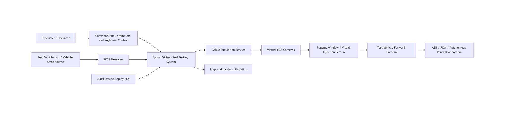


## 2.2 Product Functions

The main functional modules of the system are as follows:

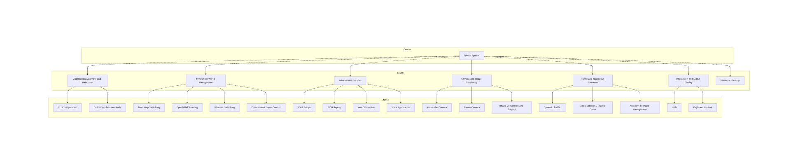


### 2.2.1 Simulation Environment and Map Management

The system connects to the CARLA server, loads the target map, and drives the simulation in synchronous mode. The map may be a CARLA built-in Town map or an OpenDRIVE `.xodr` file. After loading the map, the system creates the ego vehicle and provides the world object for sensors, traffic participants, and accident scenarios.

### 2.2.2 Vehicle Data Synchronization

The system supports two vehicle data sources: ROS2 real-time messages and JSON offline replay. Vehicle state data includes timestamp, rotation, and velocity. The system converts yaw from the ROS coordinate system to the CARLA coordinate system and applies velocity to the CARLA ego vehicle.

### 2.2.3 Rendering and Visual Injection Support

The system supports monocular and stereo camera modes. Monocular mode uses a full-width image. Stereo mode displays left and right camera views side by side. The rendered result is displayed through a Pygame window and can be used for external screen-based visual injection experiments.

### 2.2.4 Traffic and Hazardous Scenario Management

The system generates dynamic traffic, static vehicles, and traffic cones according to map type, and connects hazardous scenario logic through the accident manager. For maps without pedestrian navigation mesh, the system conservatively disables accident simulation by default to avoid runtime crashes.

### 2.2.5 Runtime Control and Status Display

The system provides command-line parameters for host, port, map, data source, camera mode, environment layers, and accident simulation switches. During runtime, the operator can use keyboard shortcuts to switch weather, show or hide environment layers, inspect camera mode, reset yaw calibration, enable manual keyboard driving, and exit the system. The HUD displays speed, yaw, weather, camera mode, ROS data freshness, and accident status.

## 2.3 User Characteristics

### 2.3.1 Experiment Operator

Experiment operators start the CARLA service, run Sylvan, configure maps and data sources, monitor the simulation window, and coordinate vehicle-level experiments in a closed test environment. They need basic command-line skills, CARLA usage experience, and vehicle testing safety awareness.

### 2.3.2 Developer and Tester

Developers and testers extend data sources, scenario logic, rendering parameters, accident management, and performance optimization. They need familiarity with Python, the CARLA API, ROS2, Pygame, and autonomous driving simulation workflows.

### 2.3.3 Project Reviewer and Researcher

Project reviewers and researchers focus on system goals, implementation scope, experimental metrics, and validation results. They may not modify the code directly, but they need to understand the system structure, requirement coverage, and acceptance criteria.

### 2.3.4 Safety Supervisor

Safety supervisors confirm whether real vehicle experiments are conducted in closed, safe, and controllable conditions, and supervise personnel, vehicle, and equipment risks during AEB/FCW trigger tests.

## 2.4 Constraints

### 2.4.1 Technical Constraints

1. The core implementation language is Python.
2. The simulation platform depends on CARLA; the target version in the project charter is CARLA 0.9.15.
3. Real-time vehicle data integration depends on ROS2 and `rclpy`.
4. Image display and keyboard event handling depend on Pygame.
5. The custom ROS message `testcarla_interfaces.msg.Gongjicarla` is preferred when available; otherwise `Float32MultiArray` is used as a fallback.
6. The system uses the CARLA Python API to manage worlds, actors, sensors, weather, and environment objects.

### 2.4.2 Hardware and Experimental Environment Constraints

1. High-fidelity CARLA rendering requires significant GPU, CPU, and memory resources.
2. Real vehicle experiments use the existing Tesla Model 3 platform, external IMU, portable computing platform, and visual display/injection devices.
3. Vehicle-level experiments must be conducted on a closed and safe site with safety personnel present.
4. The system does not include AR glasses development, multi-camera surround-view stitching, or radar/lidar multimodal sensor fusion simulation.

### 2.4.3 Performance and Safety Constraints

1. The target closed-loop latency is no more than 50 ms.
2. The target virtual signal injection success rate is at least 70%.
3. The target FCW/AEB hazardous scenario recognition and trigger success rate is at least 70%.
4. The system must not modify the test vehicle's CAN bus, low-level controllers, or original autonomous driving software.
5. When a map lacks pedestrian navigation mesh or has a segmentation fault risk, accident simulation should be disabled by default unless explicitly forced by the operator.

### 2.4.4 Interface Constraints

1. The default CARLA connection address is `127.0.0.1:2000`, which can be overridden by command-line parameters.
2. ROS2 subscribes to primary topics `/carlatest` and `carlatest`, and attempts to subscribe to several fallback vehicle data topics.
3. The root node of a JSON replay file must be an array, and each element should follow the vehicle state data structure.
4. Command-line parameters and keyboard shortcuts are the primary user interaction interfaces in the current system.

## 2.5 Assumptions and Dependencies

### 2.5.1 Assumptions

1. The CARLA server can start normally and accept Python client connections.
2. The external IMU or vehicle state source can stably output pose and velocity data.
3. The ROS2 communication network is stable enough in the experiment environment and does not suffer from continuous packet loss or long blocking.
4. The visual display/injection device can provide recognizable virtual images to the test vehicle's forward camera.
5. Operators can complete basic calibration of the vehicle, screen, IMU, CARLA, and Sylvan before experiments.

### 2.5.2 Dependencies

1. CARLA provides roads, vehicles, sensors, weather, maps, and traffic management.
2. ROS2 provides real-time vehicle state message communication.
3. Pygame provides image windows, event handling, and HUD rendering.
4. Local JSON files provide offline replay data.
5. The test vehicle's AEB/FCW system responds to visual injection results.

## 2.6 Requirements Allocation

System requirements are allocated to the hardware adaptation layer, core algorithm layer, and application control layer.

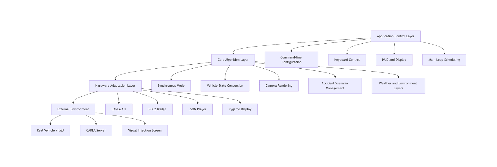


| Layer | Main Requirements | Corresponding Modules |
|---|---|---|
| Application control layer | Startup configuration, main loop, input events, HUD, exit and cleanup | `app`, `ui` |
| Core algorithm layer | State synchronization, yaw calibration, camera mode, accident scenarios, environment control | `data_sources`, `sensors`, `accidents`, `world` |
| Hardware adaptation layer | CARLA connection, ROS2 communication, JSON reading, Pygame display | `core`, `bootstrap`, `data_sources`, `ui` |

---

# 3. Specific Requirements

## 3.1 External Interface Requirements

### 3.1.1 User Interfaces

The user interface consists of the command-line interface, Pygame simulation window, HUD status overlay, and keyboard shortcuts.

General UI principles:

1. The default Pygame window size is 1200 x 600.
2. Monocular mode should use the full window width for the forward image.
3. Stereo mode should display left and right camera views side by side, separated by a center line.
4. The HUD should overlay speed, yaw, weather, camera mode, FOV, keyboard control status, ROS status, and accident status.
5. System exit should support both window close and the `Esc` key.

The main UI relationship is shown below:

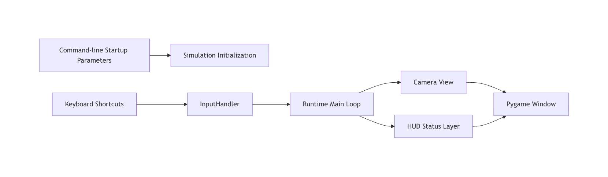

Keyboard shortcut requirements:

| Key | Function |
|---|---|
| `Esc` | Exit the system |
| `R` | Switch weather |
| `K` | Enable/disable keyboard vehicle control |
| `B` | Toggle building visibility |
| `V` | Toggle vegetation visibility |
| `F` | Toggle fence visibility |
| `P` | Toggle pole visibility |
| `M` | Toggle wall visibility |
| `L` | Print current environment layer status |
| `H` | Hide all major environment objects |
| `J` | Show all major environment objects |
| `C` | Print current camera mode information |
| `Y` | Reset yaw calibration |

### 3.1.2 Hardware Interfaces

Hardware interfaces include the external IMU or vehicle state source, portable computing platform, display/visual injection device, and test vehicle forward camera.

The hardware interface relationship is shown below:

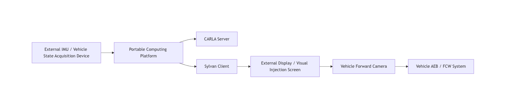

Hardware interface requirements:

| ID | Requirement | Priority |
|---|---|---|
| H-01 | The system shall support receiving pose and velocity data from an external vehicle state source. | High |
| H-02 | The system shall support outputting the rendered window to a display device usable for visual injection experiments. | High |
| H-03 | The system shall not directly control the low-level actuators of the test vehicle. | High |
| H-04 | The system should complete manual calibration of display position, camera view, and vehicle pose before real vehicle experiments. | Medium |

### 3.1.3 Software Interfaces

Software interfaces include the CARLA API, ROS2, JSON files, Pygame, and the operating system file system.

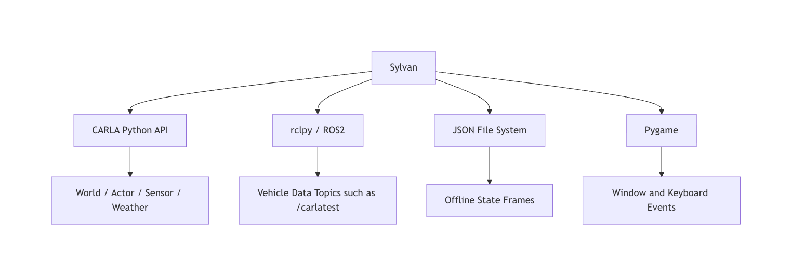

Software interface requirements:

| ID | Requirement | Priority |
|---|---|---|
| S-01 | The system shall use the CARLA Python API to connect to the server, load maps, and create actors and sensors. | High |
| S-02 | The system shall subscribe to vehicle state topics through ROS2 and convert messages into a unified internal data format. | High |
| S-03 | The system shall support reading offline vehicle state frames from JSON files. | High |
| S-04 | The system shall use Pygame to display images and handle keyboard events. | High |
| S-05 | The system should log errors and attempt safe exit when CARLA, ROS2, or Pygame resources fail. | Medium |

### 3.1.4 Communication Interfaces

The ROS2 communication data flow is shown below:

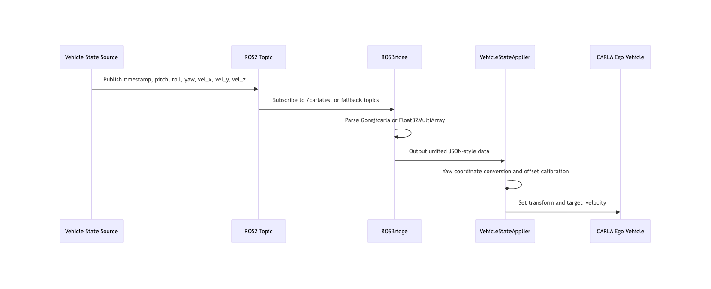


Communication interface requirements:

| ID | Requirement | Priority |
|---|---|---|
| C-01 | ROSBridge shall subscribe to the two primary topics `/carlatest` and `carlatest`. | High |
| C-02 | ROSBridge should attempt to subscribe to fallback topics including `/vehicle/data`, `/carla/vehicle_data`, `/vehicle_data`, and `/data`. | Medium |
| C-03 | ROSBridge shall support the custom message `Gongjicarla`, and use `Float32MultiArray` as a fallback when unavailable. | High |
| C-04 | ROSBridge shall record the most recent data update time and provide data freshness checking. | High |
| C-05 | The system should output a warning log when no vehicle data has been received for more than 5 seconds. | Medium |

## 3.2 Functional Requirements

### 3.2.1 Use Case Analysis

The main use cases involve the experiment operator, developer/tester, vehicle state source, CARLA service, and test vehicle.

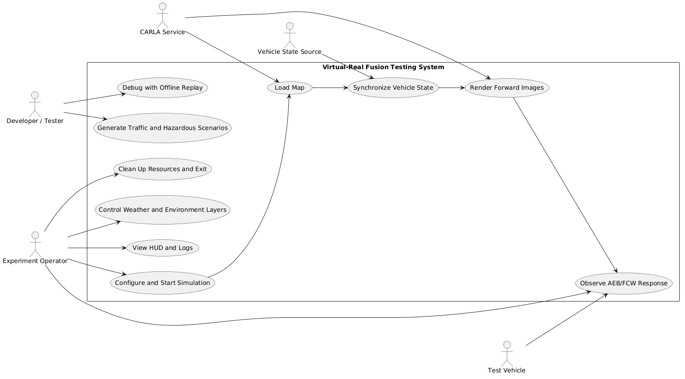


### 3.2.2 CARLA Simulation Environment Management Module (F-SIM)

| ID | Requirement | Priority |
|---|---|---|
| F-SIM-01 | The system shall allow users to configure the CARLA service address through `--host` and `--port`. | High |
| F-SIM-02 | The system shall connect to the CARLA server and obtain the current world during startup. | High |
| F-SIM-03 | The system shall set the CARLA world to synchronous mode and advance the simulation at a fixed FPS. | High |
| F-SIM-04 | The system shall create an ego vehicle actor and register it in the actor registry for unified cleanup. | High |
| F-SIM-05 | The system shall restore or release CARLA, Pygame, and ROS2 resources at the end of execution. | High |

The simulation main loop is shown below:

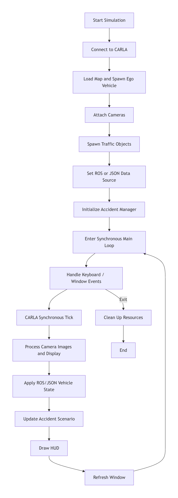

### 3.2.3 Map and OpenDRIVE Loading Module (F-MAP)

| ID | Requirement | Priority |
|---|---|---|
| F-MAP-01 | The system shall allow users to specify a CARLA built-in Town map or a `.xodr` file through `--map`. | High |
| F-MAP-02 | When the target is a built-in map, the system shall search available maps and switch to the target map. | High |
| F-MAP-03 | When the target is a `.xodr` file, the system shall resolve the file path and generate an OpenDRIVE world. | High |
| F-MAP-04 | When a built-in map does not exist, the system should keep the current world and output a warning. | Medium |
| F-MAP-05 | When an OpenDRIVE file does not exist or fails to load, the system shall stop startup and output an error log. | High |

### 3.2.4 Vehicle State Synchronization Module (F-STATE)

| ID | Requirement | Priority |
|---|---|---|
| F-STATE-01 | The system shall define a unified vehicle state structure containing `timestamp`, `rotation`, and `velocity`. | High |
| F-STATE-02 | The system shall convert ROS yaw in radians to CARLA yaw in degrees. | High |
| F-STATE-03 | The system shall calculate yaw offset when the first vehicle state is received. | High |
| F-STATE-04 | The system should support resetting yaw calibration through the keyboard. | Medium |
| F-STATE-05 | The system shall apply forward, lateral, and vertical velocity to the CARLA ego vehicle. | High |
| F-STATE-06 | The system should log warnings and skip the current frame when vehicle state data is empty or malformed. | Medium |

The vehicle state synchronization flow is shown below:

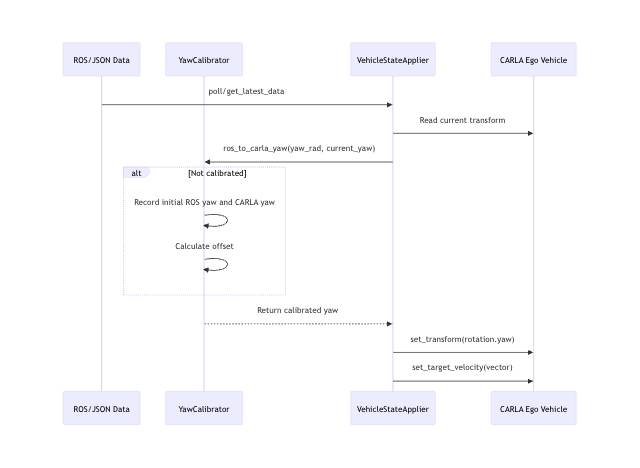

### 3.2.5 ROS Bridge Module (F-ROS)

| ID | Requirement | Priority |
|---|---|---|
| F-ROS-01 | The system shall initialize the ROS2 environment when no JSON file is specified and ROS is enabled. | High |
| F-ROS-02 | ROSBridge shall process ROS messages in a separate thread to avoid blocking the simulation main loop. | High |
| F-ROS-03 | ROSBridge shall convert received vehicle messages into the unified data structure. | High |
| F-ROS-04 | ROSBridge shall use a thread lock to protect the latest vehicle data. | High |
| F-ROS-05 | ROSBridge should periodically check available topics and automatically subscribe to relevant topics whose names contain vehicle, data, or carla. | Medium |
| F-ROS-06 | ROSBridge should provide `is_ready`, `poll`, and `shutdown` interfaces to comply with the unified data source protocol. | Medium |

### 3.2.6 JSON Replay Module (F-JSON)

| ID | Requirement | Priority |
|---|---|---|
| F-JSON-01 | The system shall allow users to specify a JSON replay file through `--json`. | High |
| F-JSON-02 | When a JSON file is provided, the system shall ignore the ROS data source and use offline replay. | High |
| F-JSON-03 | The root node of the JSON file shall be an array. | High |
| F-JSON-04 | The system should consume one JSON frame per main loop tick. | Medium |
| F-JSON-05 | When JSON data is exhausted, the system may keep the current vehicle state and output an informational log. | Low |

### 3.2.7 Monocular/Stereo Camera Rendering Module (F-CAM)

| ID | Requirement | Priority |
|---|---|---|
| F-CAM-01 | The system shall support enabling monocular camera mode through `--mono-camera`. | High |
| F-CAM-02 | The system shall support enabling stereo camera mode through `--stereo-camera` or default configuration. | High |
| F-CAM-03 | The monocular camera should use a 1200 x 600 image size and 110-degree FOV. | Medium |
| F-CAM-04 | The stereo camera shall create two RGB cameras, each occupying half of the window width. | High |
| F-CAM-05 | Cameras shall be rigidly attached to the forward position of the ego vehicle. | High |
| F-CAM-06 | The system shall convert raw CARLA images into Pygame surfaces and draw them to the display window. | High |
| F-CAM-07 | Stereo mode may draw a separator line between the left and right images. | Low |

The camera rendering data flow is shown below:

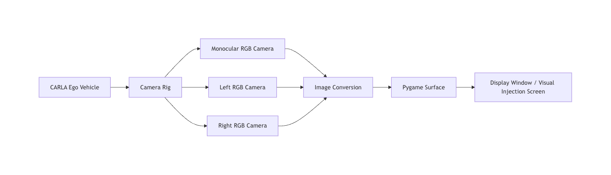

### 3.2.8 Weather and Environment Layer Control Module (F-ENV)

| ID | Requirement | Priority |
|---|---|---|
| F-ENV-01 | The system should read available weather presets from CARLA `WeatherParameters`. | Medium |
| F-ENV-02 | The system shall support runtime cycling through weather presets. | High |
| F-ENV-03 | The system shall support hiding or restoring buildings, vegetation, fences, poles, and walls. | High |
| F-ENV-04 | The system should support `--clean-environment` to remove major environment objects at once and create a clean scene. | Medium |
| F-ENV-05 | The system should support initially hiding buildings, vegetation, and fences through command-line parameters. | Medium |
| F-ENV-06 | The system shall restore hidden environment objects during cleanup. | High |

### 3.2.9 Traffic Participant and Obstacle Generation Module (F-TRAFFIC)

| ID | Requirement | Priority |
|---|---|---|
| F-TRAFFIC-01 | The system shall support dynamic traffic generation on CARLA built-in maps. | High |
| F-TRAFFIC-02 | The system should generate static vehicles and traffic cones on OpenDRIVE maps to avoid relying on dynamic traffic management. | Medium |
| F-TRAFFIC-03 | Traffic actors generated by the system shall be registered in the actor registry. | High |
| F-TRAFFIC-04 | The system shall destroy generated traffic actors on exit. | High |

### 3.2.10 Accident/Hazardous Scenario Management Module (F-ACC)

| ID | Requirement | Priority |
|---|---|---|
| F-ACC-01 | The system shall automatically decide whether to enable accident simulation according to map type. | High |
| F-ACC-02 | The system shall disable accident simulation by default on OpenDRIVE maps or maps without pedestrian navigation mesh. | High |
| F-ACC-03 | The system should allow users to force-enable accident simulation through `--accidents`. | Medium |
| F-ACC-04 | The system shall allow users to force-disable accident simulation. | High |
| F-ACC-05 | The accident manager shall update accident scenarios on every main loop tick. | High |
| F-ACC-06 | The accident manager should provide accident active status for HUD display. | Medium |
| F-ACC-07 | Incident statistics should record successful crossing, potential collision, timeout, vehicle braking, and vehicle lane change results. | Medium |

Accident scenario states are shown below:

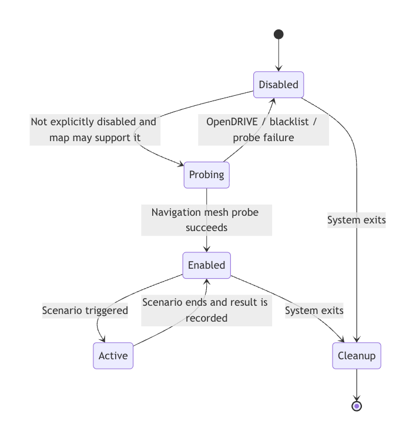

### 3.2.11 HUD and Runtime Status Display Module (F-HUD)

| ID | Requirement | Priority |
|---|---|---|
| F-HUD-01 | The HUD shall display ego vehicle speed in km/h. | High |
| F-HUD-02 | The HUD should display ego vehicle yaw. | Medium |
| F-HUD-03 | The HUD should display the current weather name. | Medium |
| F-HUD-04 | The HUD should display the current camera mode and FOV. | Medium |
| F-HUD-05 | The HUD should display whether keyboard control is enabled, along with throttle, brake, steering, and reverse status. | Medium |
| F-HUD-06 | The HUD shall display whether ROS is enabled and whether ROS data is fresh. | High |
| F-HUD-07 | The HUD should display whether an accident scenario is active. | Medium |

### 3.2.12 Command-line and Keyboard Control Module (F-CTRL)

| ID | Requirement | Priority |
|---|---|---|
| F-CTRL-01 | The system shall provide a command-line entry point for starting the complete simulation workflow. | High |
| F-CTRL-02 | The system should support `--debug` to enable DEBUG logging. | Medium |
| F-CTRL-03 | The system shall support runtime keyboard control for weather, environment layers, manual driving, and yaw calibration. | High |
| F-CTRL-04 | The system should support manual keyboard driving mode for debugging scenes without external data sources. | Medium |
| F-CTRL-05 | When runtime camera mode switching is unavailable, the system may output a message instructing the user to specify the mode through command-line parameters. | Low |

## 3.3 Performance Requirements

| ID | Requirement | Metric | Priority |
|---|---|---|---|
| P-01 | System closed-loop latency target | Average latency from IMU/vehicle data to rendered injection should not exceed 50 ms | High |
| P-02 | Simulation target frame rate | CARLA synchronous mode target FPS is 60 | High |
| P-03 | Image display resolution | Default window size is 1200 x 600 | Medium |
| P-04 | Virtual signal injection success rate | Experimental target is at least 70% | High |
| P-05 | FCW/AEB scenario trigger success rate | Repeated experiment target is at least 70% | High |
| P-06 | ROS data freshness | Data is considered fresh when the most recent update is less than 1 second old | Medium |
| P-07 | ROS no-data warning | Output a warning when no vehicle data is received for more than 5 seconds | Medium |

## 3.4 Attributes / Non-functional Requirements

### 3.4.1 Safety and Security

| ID | Requirement | Priority |
|---|---|---|
| NF-SAFE-01 | The system shall not modify the test vehicle's CAN protocol, low-level controller, or original autonomous driving software. | High |
| NF-SAFE-02 | Vehicle-level testing must be conducted on a closed site with safety personnel. | High |
| NF-SAFE-03 | For maps that may cause CARLA segmentation faults or lack navigation mesh, the system shall conservatively disable accident simulation. | High |
| NF-SAFE-04 | On abnormal exit, the system shall release actors, sensors, ROS nodes, and display resources as much as possible. | High |

### 3.4.2 Reliability

| ID | Requirement | Priority |
|---|---|---|
| NF-REL-01 | The system shall log ROS initialization failures, JSON file errors, map loading failures, and accident manager initialization failures. | High |
| NF-REL-02 | When non-core functions fail to initialize, the system should degrade gracefully where possible. | Medium |
| NF-REL-03 | The system shall use an actor registry to manage CARLA actor lifecycles uniformly. | High |
| NF-REL-04 | ROSBridge shall use locks to protect shared data and reduce concurrent read/write risks. | High |

### 3.4.3 Maintainability

| ID | Requirement | Priority |
|---|---|---|
| NF-MAIN-01 | The system shall organize code by functional domains such as application, core, data sources, sensors, traffic, world, and UI. | High |
| NF-MAIN-02 | Data sources should implement a unified protocol to facilitate future vehicle state sources. | Medium |
| NF-MAIN-03 | Key mappings should be centrally defined to avoid duplicate hard-coded values across modules. | Medium |
| NF-MAIN-04 | Logs shall cover startup, map loading, data reception, state application, exceptions, and cleanup. | High |

### 3.4.4 Extensibility

| ID | Requirement | Priority |
|---|---|---|
| NF-EXT-01 | The system should allow additional accident scenario implementations in the future. | Medium |
| NF-EXT-02 | The system may allow additional map search paths and OpenDRIVE generation parameters. | Low |
| NF-EXT-03 | The system may allow additional sensor modes in the future, while multi-camera surround-view stitching is out of current scope. | Low |
| NF-EXT-04 | The system should allow future replacement of visual injection devices without affecting CARLA and data synchronization core logic. | Medium |

### 3.4.5 Usability

| ID | Requirement | Priority |
|---|---|---|
| NF-USE-01 | The system shall support common experiment configurations through clear command-line parameters. | High |
| NF-USE-02 | The HUD shall help operators quickly determine simulation status and data source status. | High |
| NF-USE-03 | Runtime shortcuts should cover high-frequency operations including weather, environment layers, yaw calibration, and exit. | Medium |
| NF-USE-04 | Error logs should indicate the problem source to help operators locate configuration or environment issues. | Medium |

## 3.5 Logical Data Requirements

Core data objects include vehicle state data, simulation configuration, rendering frames, environment layer status, incident statistics, and log events.

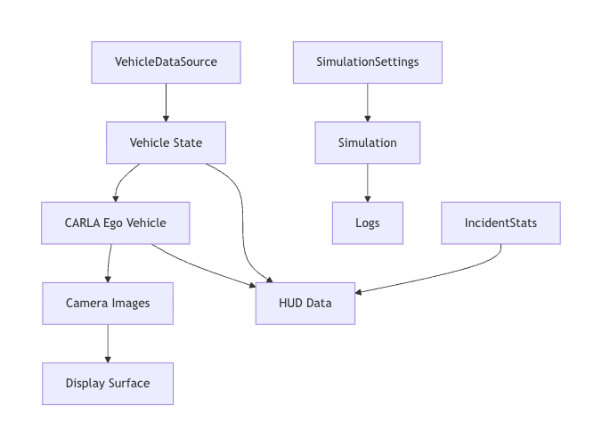

### 3.5.1 Vehicle State Data

Vehicle state data uses a JSON-style structure:

```json
{
  "timestamp": 1710000000,
  "rotation": {
    "roll": 0.0,
    "pitch": 0.0,
    "yaw": 0.0
  },
  "velocity": {
    "x": 0.0,
    "y": 0.0,
    "z": 0.0
  }
}
```

Data constraints:

| Field | Type | Description | Required |
|---|---|---|---|
| `timestamp` | number / integer | Data timestamp | No |
| `rotation.roll` | number | Roll angle | No |
| `rotation.pitch` | number | Pitch angle | No |
| `rotation.yaw` | number | ROS yaw in radians | Yes |
| `velocity.x` | number | Forward velocity | Yes |
| `velocity.y` | number | Leftward velocity; negated when applied as CARLA rightward velocity | Yes |
| `velocity.z` | number | Vertical velocity | No |

### 3.5.2 Simulation Configuration Data

Simulation configuration is converted from command-line parameters into `SimulationSettings`. Main fields include:

| Field | Default | Description |
|---|---|---|
| `host` | `127.0.0.1` | CARLA server host |
| `port` | `2000` | CARLA server port |
| `json` | empty string | JSON replay file path |
| `ros` | `True` | Whether to enable ROS data source |
| `map` | `Town04` | Target map name or `.xodr` file |
| `clean_environment` | `False` | Whether to create a clean environment |
| `layered_rendering` | `True` | Whether to enable layered rendering |
| `mono_camera` | `False` | Whether to use monocular camera |
| `stereo_camera` | `False` | Whether to use stereo camera |
| `accidents` | `None` | Whether accident simulation is explicitly enabled or disabled |

### 3.5.3 Incident Statistics Data

Incident statistics include the following counters:

| Field | Meaning |
|---|---|
| `successful_crossing` | Number of successful target crossings |
| `potential_collision` | Number of potential collisions |
| `timeout` | Number of scenario timeouts |
| `vehicle_braking` | Number of vehicle braking responses |
| `vehicle_lane_change` | Number of vehicle lane-change responses |

---

# 4. Appendices

## 4.1 Requirements Traceability Matrix

| Requirement Source | Requirement Category | Related Requirement IDs |
|---|---|---|
| Project Charter: non-intrusive virtual-real testing platform | Product scope / safety | NF-SAFE-01, H-03 |
| Project Charter: CARLA scenario engine | Simulation environment | F-SIM-01 to F-SIM-05, F-MAP-01 to F-MAP-05 |
| Project Charter: ROS bridge data bridging | Communication interface / data synchronization | F-ROS-01 to F-ROS-06, C-01 to C-05 |
| Project Charter: visual rendering and calibration | Camera rendering / yaw calibration | F-CAM-01 to F-CAM-07, F-STATE-01 to F-STATE-06 |
| POS: 50 ms closed-loop latency | Performance | P-01, P-02 |
| POS: injection success rate at least 70% | Acceptance metric | P-04 |
| POS: FCW/AEB success rate at least 70% | Acceptance metric | P-05 |
| Presentation: layered structure | Requirements allocation / maintainability | NF-MAIN-01, NF-MAIN-02 |
| Code repository: CLI, main loop, data sources, camera, environment layers | Specific functions | F-CTRL, F-STATE, F-CAM, F-ENV |

## 4.2 Command-line Parameter Summary

| Parameter | Description |
|---|---|
| `--host` | CARLA server host |
| `--port` | CARLA server port |
| `--json` | JSON data file path; ROS is ignored when provided |
| `--ros` | Enable ROS data source |
| `--debug` | Enable DEBUG logging |
| `--map` | Target map name or `.xodr` file |
| `--no-buildings` | Initially remove buildings |
| `--no-vegetation` | Initially remove vegetation |
| `--no-fences` | Initially remove fences |
| `--clean-environment` | Remove buildings, vegetation, fences, poles, and walls |
| `--layered-rendering` | Enable layered rendering |
| `--mono-camera` | Use monocular camera |
| `--stereo-camera` | Use stereo camera |
| `--accidents` | Force-enable accident simulation |

## 4.3 Acceptance Criteria

| Metric | Standard |
|---|---|
| Functional completeness | The system can complete CARLA connection, map loading, ego vehicle spawning, data synchronization, camera display, and resource cleanup |
| Data source support | The system supports ROS2 real-time data and JSON offline replay |
| Scenario control | The system supports weather switching, environment layer control, traffic objects, and accident scenario management |
| Real-time performance | The target average closed-loop processing latency is no more than 50 ms |
| Injection effect | The target virtual signal injection success rate is at least 70% |
| Scenario triggering | The target FCW/AEB hazardous scenario recognition and trigger success rate is at least 70% |
| Safety boundary | The system does not modify the test vehicle's CAN, low-level hardware controller, or original autonomous driving software |

## 4.4 Out-of-scope Items

The following items are outside the implementation scope of this stage of Sylvan:

1. Multi-camera surround-view stitching;
2. Radar, lidar, and other multimodal sensor fusion simulation;
3. AR glasses display system development;
4. Reverse engineering of the test vehicle's CAN protocol;
5. Commercial cloud platform, permission management, and multi-user management;
6. Real vehicle control strategy or autonomous driving algorithm development.
